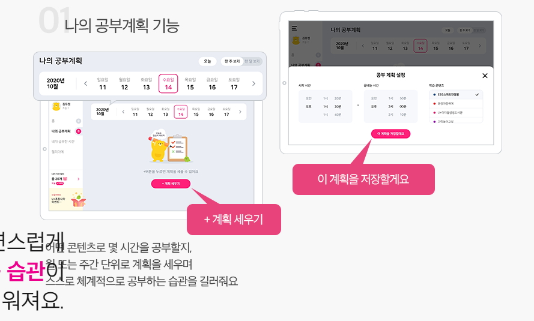
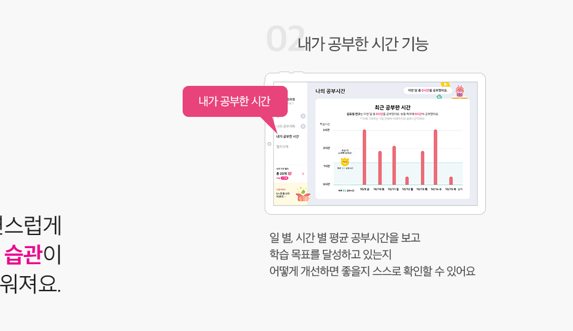
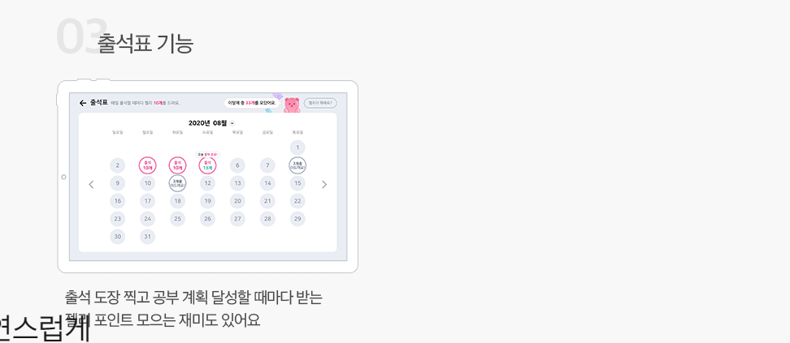
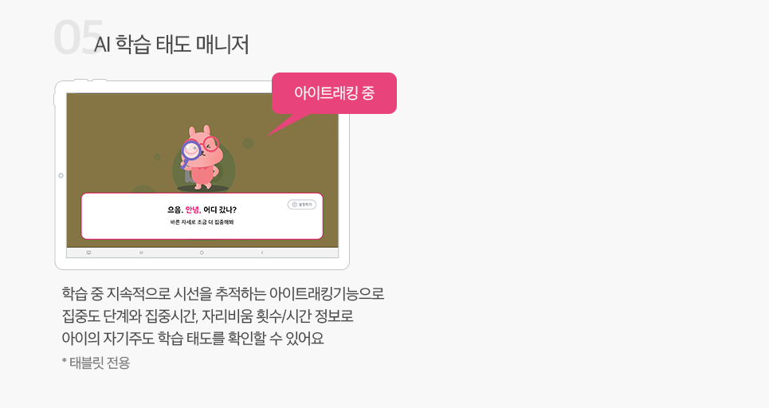
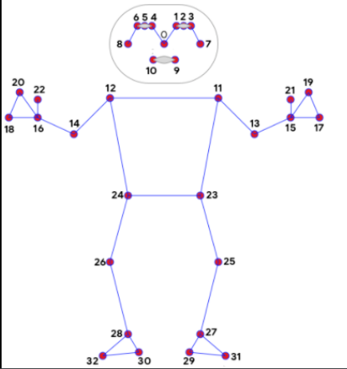

# 융복합 프로젝트: 학습관리 IoT  
: MediaPipe의 Holistic을 이용하여 얼굴, 손, 어깨 등을 인식하여 추출된 데이터를 전처리 할 예정

 

## IoT

웹소켓을 통한 영상  전송

- 이미지 전송으로 변경(초단위)

- ZOOM 외부로 링크를 가져가기

## AI

- 생성 예정 데이터 
  - 얼굴 윤곽 및 위치 

  - 눈, 코, 입 위치

  - 팔, 손 위치

  - 어깨 기준점 위치

  - 블링킹

- 만약, 스트리밍이 아니라 이미지를 전송한다면, 실시간으로 그걸 어떻게 읽어들일 것인가?

## Big Data

### 어떤 류의 강의인가??

- 시나리오가 필요 
  - 그 강의에 필요한 기능이 무엇인지
  - 어떤 상황일 때, 집중하고 있는지 판단할 수 있는지 기준을 세워보기
  - e.g. 책을 자주 보는 강의인가, 필기가 필요한 강의인가, 컴퓨터 자체를 활용해서 하는 강의인가, 학생 층은 어떻게 되는가
    - LG U+- AI학습태도매니저
    - 태블릿으로 시선 확인 후, 알림으로 주의 환기 - 학습 종료 후, 학습태도와 집중도 분석 결과 제공
    - https://www.yna.co.kr/view/AKR20201216039900017

### 생성 예정 변수

집중: 얼굴을 고정하고, 눈을 고정하는 것

#### 	집중도(1시간 단위로 끊어볼까??)

1. 코와 눈 간격 - 얼굴을 돌리는지(7번, 8번이 0에 가까우면)

2. 고개를 숙이는 것 - 0번이 9와 10의 y값

3. 얼굴이 부산하게 움직이는 지 - 0번이 통상적으로 움직이는 범위를 계속 벗어나는 지 확인

4. 블링킹

#### 	이탈률

1. 자리를 비웠는가
2. 자리 비운 사람들의 비율이 50%이상일 경우, 쉬는 시간으로 처리 - 이탈률 데이터로 들어가지 않음
3. 이탈률이 하루 강의 시간의 60% 이상일 경우 결석

#### 제외값

1. eye tracking 사용 X
2. 결석 != 이탈률

### 데이터 시각화 

#### 	인터페이스(동적 그래프)   - 구글 개발자 차트(Django)

- 전체 학생 데이터 - 산점도(전체 학생들의 평균 집중도 시간 - 일 평균), 막대그래프(강의 출석일 / 진행 강의일)  
- 개별 학생 데이터 - 선(이탈률) + 막대(집중도) -[x = 시간, y = 값]

  #### 발표용 시각화

  - 산점도  
  - 선그래프  
  - 박스그래프  
  - 파이그래프  
  - 방사형  
  - 워드 클라우드
  - 연관성 분석 그래프

### 데이터 전처리 및 전송

#### 	클라우드 AWS - Django?

- 전처리

- 시각화

  #### MariaDB(AWS)

  - AI 측 생성 데이터 보관
  - 클라우드 Django와 연동하여 웹클라이언트 요청 시, 읽어오기

## 클라우드

진행상황

- 프론트 구조와 디자인 설계
- 메튜바 추가 및 구현
- DB에 임시데이터를 삽입해 프론트와 백엔드 연동 시도
- 학생 개인에게 노티를 하는 것은 - 부모님 전화(카톡) - 실시간 아니어도 좋음

문제점

- DRF의 JWT Token 방식으로 회원가입 및 로그인 구현
- Django Pass Word ResetView의 커스터마이징에 어려움이 있음
- DRF allauth를  이용한 SNS 로그인에 문제

# 데이터 전송 순서

- IoT -> AI -> 생성된 데이터를 MariaDB -> 클라우드 웹클라이언트의 요청이 있을 때, DB에서 데이터를 가져가서 처리하기
- MediaPipe가 AWS가 아니라 IoT에서 넘길 때, 가능할 지 알아보기
  - IoT 디바이스에서 MediaPipe를 사용할 수 있는지 알아보기(가격)

# 멘토링 21.11.13

1. Cloud 프론트보다 클라우드 쪽에 집중하기, 우선순위!!
   - https://integer-ji.tistory.com/277
2. 집중도를 판단할 때, 지속성을 함께 보기(시간 단위 확인) - 경계점은 납득 가능한 기준을 찾기
3. 집중도의 경감요소들에 대해서 고려하는 것 말고, 증가 요소도 함께 파악해보기
   - 집중이 지속될 때, 집중도의 증가를 설명할 변수는 무엇이 될 수 있을까?
   - 단기 집중, 장기 집중
4. 좀 더 도전적인 목표로, Eye Tracking을 해서  홍채의 방향을 확인하는 걸 할 수 있지 않을까?(+ 시간 여유 시)
   - 얼굴의 방향 말고, 시선을 파악하는 것도 좋을 것으로 생각됨
   - MediaPipe는 구글에 의해서 만들어진 것이므로, Eye gaze direct classification 오픈소스(CNN 학습한 것)를 통해서 다양한 시도를 해보는 것은 어떨까?
   - 연구 논문을 통해서 구체화
5. Open소스 API 사용하는 어려움
   - 설명이 부족할 때, Stackoverflow , Redit에서 한 번 서칭

6. IoT 영상
   - 학생이 여러명일 때, 화면 처리 이슈를 어떻게 할 때
7. IoT 아두이노 어떻게 할 것인지, 알아보기
   - LED 달아서 하는 건, 좋을 듯
8. 데이터(영상 정보)의 흐름, 가져오는 방법을 알아보는 것이 중요할 듯!
   - https://marketplace.zoom.us/docs/api-reference/zoom-api/meetings/meetinglivestreamupdate (클라우드, 홍기운 멘토님)
   - ZOOM의 이미지 스트림을 사용 가능, 위치값들을 시계열 DB에 쌓아놓기
   - 뉴럴 네트워크 엔진을 가져갈 수 있는, 플랫폼이 깔리는 디바이스가 필요
   - 아니면, 클라우드 측에서 웹상에서 할 수 있는지 확인
   - 정 안 되면 문제점에 대해서 논의점을 제기하는 것으로 하기
9. 집중도와 이탈률의 변수를 계산하는 방법을 정의하시외
   - 알고리즘이 없고, MediaPipe에서 오는 결과값이므로, 값으로 오차를 보는 것은 힘들 듯
   - 계산의 정확도에 대한 고민이 필요
10. 강사나 학생에게 어떤 정보를 전달해 줄 것인가에 대해 고민해보기
    - 어떤 정보가 필요할 것인가?
    - 집중도가 맞는지, 이탈률이 맞는지, 어떤 비율로 줄 것인지에 대해 고민해보기
    - 몰입도 고려하기
    - 시나리오 - 가설, 흐름, 결과(집중도, 이탈률) - 연역적, 귀납적 보기 - 인사이트
    - 집중도의 설득력 - 조작적 정의
      - 집중도의 수치에서 그치는 게 아니라 수치에서 의미하는 바를 강사나 학생에게 전달할 수 있는 방법을 생각해보기(강의의 재미, 집중주의와 같은 행동을 유발하는 것을 추가)
      - 집중력은 시간에 따라 변화하므로, 그 패턴에 따른 공부나 지도 방법의 전략을 찾는 것

11. 집중력과 관련된 행동들의 목록을 뽑아서, 해당되는 행동을 보일 시의 집중력을 판단할 수 있도록하자(매칭)
    - 행동으로 캐칭하는 것은 어려울 수 있음 -> 동공인식을 한 번 고려해보기
    - 상황에 대한 시나리오가 필요(ZOOM)
    - 이벤트를 일으키고, 이벤트를 캐치하는지
    - 논리적인 검토와 보완점을 찾자
12. 정수진 멘토님
    - 집중도(교육학) - 나와있는 공식
    - 민국 오빠가 찾은 거 - https://www.kci.go.kr/kciportal/ci/sereArticleSearch/ciSereArtiView.kci?sereArticleSearchBean.artiId=ART002648487
    - 지금의 API같은 경우에는 개별차를 파악하기 어려움 -> 사람 오차
    - 이탈률은 알 수 있을 듯
    - 집중도에 대한 정의 - 처음에 근거를 통해서 조작적 정의
    - 1시간 동안 집중도에 대한 기준점을 잡고, 진행할 것
    - 좌표의 절댓값은 오차가 있거나 계산이 어려울 수 있음
    - 집중력 요소를 산정 -> 몇 개를 충족하면, 집중한다고 보겠다. - 빅데이터의 영역
    - 모든 것을 반영하는 것보다는 하나를 정해서, 접차 넓혀가는 것이 좋을 수 있음
    - 우선 근거가 필요(정상 집중 시간 같은 기준치가 필요)
    - 찾아본 수치값이랑 우리가 나오는 값이랑 유사하게 맞추기
    - 최적의 점수는, 나중에 추후에 확장될 예정이다라고 하는 것이 좋음(한계점으로 두고)
    - 베타 서비스 & 설문지를 사용할 수도 있음 - 예시
13. 랜드마크 설정해서 추적해야 할 것 같다
    - 비대면 말고 E-러닝 시스템에서도 사용 가능 / 국가교육이 많음/ 집중도/ 일방적 교육이니까
    - 회사 엔지니어랑 연결 - ihchoi@sundosoft.co.kr

