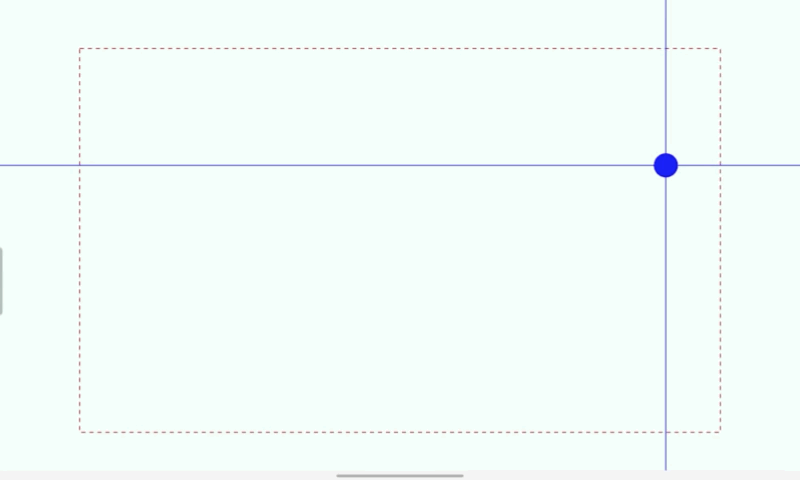
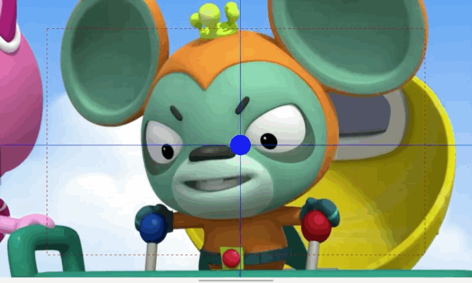
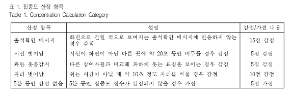

# 가용데이터(변수 값)

시간(5초 단위)

이탈율 - 1

고개 숙임 - 2

고개 돌림 - 3

눈 감는 거 - 4

시선 이동 - 5

# 데이터 테이블

- 데이터 테이블(가용데이터별 테이블 - 이탈율, 고개숙임, 고개돌림, 눈감음, 시선 이동), 사람 테이블(외래키)

| 시간     | 이름   | 이탈율(고개숙임, 고개돌림, 눈감음, 시선 이동) |
| -------- | ------ | --------------------------------------------- |
| 21.11.19 | 박현욱 | 80                                            |
| 21.11.20 | 박현욱 | 48                                            |
| 21.11.19 | 박민국 | 94                                            |
| 21.11.20 | 박민국 | 67                                            |

- 시각화 용 테이블 (예상 테이블)
  - 일별 테이블

| 사람   | 시간(일별) | 이탈율(%) | 집중도(%) | 출석(%) |
| ------ | ---------- | --------- | --------- | ------- |
| 박현욱 | 21.11.19   | 80        | 75        | 100     |
| 박현욱 | 21.11.20   | 48        | 32        | 50      |
| 박현욱 | 21.11.21   | 94        | 76        | 66.7    |

​	

- 1시간별 테이블

| 시간              | 이탈율 | 집중도 |
| ----------------- | ------ | ------ |
| 21.11.19 10:10:05 | 80     | 75     |
| 21.11.19 10:10:10 | 48     | 32     |
| 21.11.19 10:10:15 | 94     | 76     |

### 시각화

전체 학생 데이터(일별) - 산점도(전체 학생들의 평균 집중도 시간 - 평균), 막대그래프(강의 출석일 / 진행 강의일)

개별 학생 데이터(10분) - 선(이탈률) + 막대(집중도)

- 자바스크립트를 이용한 동적그래프 - 다이내믹, 이벤트
- 주피터 - 시각화도 OK

# 이주의 내용

- PPT 내용 설명
  - 데이터 시나리오 알아보기 위한 논문 탐색
  - 데이터 테이블 구성

# 차주 내용

1. DB 구성 및 연결
2. 집중력 측정 및 계산
3. 기존의 장고 모델 활용에 대한 스터디(복습)

# 강사님 Answer

### 강사님 문의

1. DB 자동 수정 - 데이터 삭제 및 관리, 업데이트
   - 마리아 DB 테이블 생성 - Django
   - STUDY: thirdapp - 콘솔에서 장고 API 사용해서 하는 것, fourthapp 
   - 날짜별로 지우는 거는 - SQL(강사님 도움)
   - 명령어를 실행해야 하는 것이 아니라, Django를 이용하면, 함수를 이용하면 됨
   - 이미지를 사용한 정적그래프

### 결과보고서와 발표 안내

1. 지금까지 해온 내용 완료보고서에 임팩트있게 해보자~!! - 어필 열심히
2. 다른 기술 친구들과의 협업과 역할을 함께 소개하기

# 멘토링

- AI - 다양성에 대한 문제
- AI - 다양한 환경에 대한 정보를 추가하는 것이 좋을 듯(카메라의 위치는 고려 - 위, 아래) - 
- 빅데이터 - 고민을 했다는 사실을 어필하기!!
  - 개인 오차를 인지하고 극복하기 위한 접근을 했다는 부분을 이야기 할 것	
    - 전체적으로 하나의 방법을 적용한 게 아님을 얘기하기
  - 정면에서 인식하는 거라는 것을 미리 공시하기
  - further study에 대한 내용을 언급하기
  - 처음에 정자세를 보였을 때, 기준이 있음을 언지하기
- 눈동자 CNN을 사용해보기
- 집중도 - 시간 및 20초 단위의 전체를 어떻게 볼 것인지
  - 단기 집중? - 1시간에 1분 동안 비집중
  - 장기 집중? - 1시간에 20초간 3번씩 비집중
- 아쉬움에 대한 얘기 - 시간이라는 제약 속에 고민의 깊이를 충분히 반영할 수 있도록 진행
- IoT
  - 데이터의 흐름이 중요
  - 시작 데이터의 스트리밍을 진행하고, 실제 데이터의 흐름을 보는 것이 중요!
  - CNN과 스트리밍이 안 맞을 수 있음 - 스냅샷
    - 스트리밍은 RNN에 적합함
    - OpenCV 해당 영상을 이미지로 만들어서 데이터 처리해야 할 듯
    - 초당 프레임이므로 프레임의 기준을 잡고 실시할 듯
- 각각의 파트를 조립하는 과정을 빨리 만들어야 할 듯 - 데이터 통신의 흐름 빨리 잡자!!
- 스트리밍 데이터를 스크린샷 이미지로 만들어서 분석 - 성능 문제가 있을 수 있음
  - IoT 자체에서 프레임을 나눠서 줘야 할 듯
  - 실시간 데이터 처리에 어려움을 겪을 수 있음
  - 해당 인스턴스 내에서 처리가 가능한지 판단해보기 - 리소스가 부족할 수 있음
  - 실시간 데이터의 성능으로 인해서 고민해보기
- 관통을 하는 데이터를 실시하는 것이 다음주에 당장 이뤄져야 할 것
  - 흐름을 만들어 놓고, 실시하면서 수정하는 것으로 하기
  - 이미지 파일로 처리하여서 S3를 사용하는 것이 나을 듯 - RDB보다는 MariaDB는 어려울 듯
  - 하지만, 데이터의 교환은 RDB가 낫다
- IoT - 마이크는 어째서?
  - 영상만 하는 것이 아닌가요?

- 인공지능의 알고리즘의 파라미터 튜닝이 필요할 수 있음
  - 전이학습 시켜보기
- 빅데이터 - 데이터를 AI 알고리즘에 맞춰서 준다던가
  - 워크멘테이션?? 해보기
- 일별 테이블 = 평균으로 계산하는 것보다 가치있는 정보를 줄 수 있게끔 다양한 차별점을 고민해보기
  - 구간별 집중도
  - 시간, 사람 관점 외의 다른 관점으로 로우 데이터를 가공할 수 있도록 더 깊이 고려해보기
  - 강사와 학생에게 전달할 수 있는 차별점을 고민해보기
  - 집중력이 흐트려진 학생과 수업에 집중한 학생의 점수나 결과물을 상관이나 회귀 등을 사용하여, 데이터 간의 관계에 대한 탐색도 함께 해보기
  - 다양한 데이터의 검토와 결과 가능성을 생각하자

1.  데이터 흐름 테스트
2.  DB 연동 확인하기
3.  데이터 자동 처리되는지 확인하기
4.  이미지 보내는 것 DB 확인하기
5.  인스턴스 구성 확안하기
6.  집중도 20초 - 장기 단기 집중도 구분하기
7.  AI 처음의 태도를 학습 - 기간, 비교 어떻게, 그게 어떻게 집중도에 영향을 주나요??
   - 판별만 할 건가요?
   - 목 길이도 최초의 태도를 기반으로 판별하는 것이 맞는가?
8. 현재 - 집중도가 있다, 없다
   - 그래서 구체적인 집중도는 어느 정도인가?

## 집중도 판단 식 세워보기

- 현재 집중도 계산 방법

  - x = 집중이 흐트러진 시간(5초 단위) 
  - x  / 540(60 * 60)
  - 몰입 지속 시간 - 가중치를 어떻게 넣을 것인가 ?

- Gaze Tracking을 집중도 계산에 포함하기(saccade, fixation) - [출처](https://visual.camp/ko/attention-metric-eye-tracking)

  - 집중이 되지 않을 때

  

  - 집중이 될 때
  - 

  - 또는, 감점, 가점 요소를 정해두고 이에 따라 계산을 하게끔 함
  - 김효진 등(2021). 화상 강의 집중도 관리 시스템 : Eyes on you
  - 

- 집중도 산정 항목(원 논문)- 70점에서 시작, 100점이 만점
  - 감점
    - 5점 - 시선이 화면이 아닌 다른 곳에 20초
    - 5점 - 다른 참여자들과 비교해 과하게 웃는 표정
    - 10점 - 쉬는 시간이 아닐 때, 약 10초 정도 자리를 비울 경우 감점
  - 가점
    - 5점 - 5분 동안 집중도 점수가 감점되지 않을 경우 가점
- 집중도 산정 항목(프로젝트)
  - 감점
    - 얼굴 돌리는 것 - 20초간 지속
    - 고개 숙이는 것 - 20초간 지속
    - 눈 감는 것 - 20초간 지속
    - 동공 위치
  - 가점
    - 5분 동안 집중도 점수가 감점되지 않을 경우 가점

