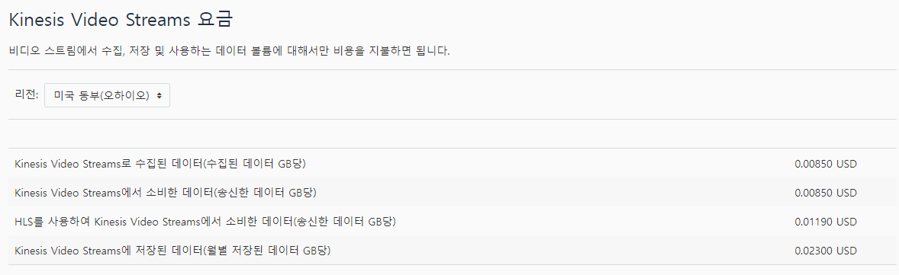

# 멘토링11/06 

## 빅데이터

사용자에게 필요한 기능(ZOOM,  비대면 강의 찾아보기) - 시나리오 써보자
왜 해야하는지 찾아보자

### 김원배 멘토님!!(상냥스)

1. API - 구글 개발자 차트 - 자바 스크립트 코드(Django) - 웹베이스 표출
   시스템이 아니라 예시로(오프라인)

2. 외부 시스템(오버일 듯)
   캐블론??(시각화 프로그램) - iframe
   elk(키바나에서 시각화) - iframe(무거움)

3. 어떻게 데이터로 연계해야 하는가??
   다 따로면, API로
   DB로 해라
   실시간 전송 - 카푸카

### 한지후 멘토님

1. 일단 익숙한 방법

2. 기술적인  건 AI
   집중도의 정의를 먼저 내리자

### 이정숙 멘토님

주제 선정 GOOD
교육 프로그램 - lms
ZOOM 

- 집중도 판단 기준은 뭔가요?
  1. 어깨 선
  2. 얼굴
       자세가 틀어지거나
  3. 눈을 감고 있는지 뜨고 있는지

- 수학, 과학 영역이면 어떡할 것인가?
  1. 학생 개인에게 노티를 하지는 않을 것인가?? - 수업 집중에 도움이 될 듯 - 양방향
  2. 어떤 류의 강의에서 사용할 지 시나리오 - 집중에 대한 정의에도 도움이 될 듯
  3. 재택 근무에 대한 감시 프로그램 보기

## 홍지후 멘토님

- 집중도 그래프 단위는?
   x = 시간, y = 집중도

- 만약에, 집중이 글을 쓰는 거라면?
   1. 얼굴 인식이 안 될 텐데!
   2. 어떤 것에 집중하는 건지 한 번 보기

1. '집중력 지수'의 조작적 정의를 먼저 내리자 - 시연 관련 시나리오 - 10분 단위 움직임으로 하던가, 눈의 깜빡임의 횟수 
   - 빅데이터의 역할, 집중이란 무엇인가? 변수로 뭘 사용할 것인가? - '보고서에 담기(기준 잡고 가기) - 다음 주까지'
   
   

## 클라우드

1. MQTT 통신을 이용한 방식으로 스트리밍 서비스를 React에서 지원되는가?

   - 프로토콜을 사용하는 게 맞음

   - 시간대 별로 사진으로 분석
   - AI에서 실시간으로 어떻게 저장하고, 처리할 지 결정해야 함

2. AI, 빅데이터팀이 처리한 동적데이터를 어떻게 실시간으로 시각화 해야 하는가?

## AI

1. 기술적으로 난이도가 떨어짐
2. 추가로 AI 학습이 필요 - 영상데이터를 기반으로 추가 학습
3. 이탈자를 찾아보기(게임하는 것도 모니터링을 본다)
4. 아이트래킹 - 집중력의  시기
5. 가상의 학생을 만들고 분석, 데이터 필요 - 학업 성취도 평가를 할 수 있을 듯
6. 타겟층 세분화(저학년, 부모님도)
7. 상품성, 쇼 특화
8. 빅데이터랑 업무 분담

## IoT

1. 스트리밍 한 것을 어느 분야로 보낼 것인가?
2. 아웃풋 데이터를 어떻게 사용할 것인가?
3. 강사용 디바이스가 필요한가?
4. 사이버 강의에도 사용 가능할 것 같아서 좋음
5. LG - AI 학습 태도 매니저

- CNN 기반 동공 영역 분할 방법 연구

https://scienceon.kisti.re.kr/srch/selectPORSrchArticle.do?cn=DIKO0015487060

# 멘토링 종합

1. 스트리밍 말고, 사진으로 보내기
   - 데이터 전용 인스턴스(실시간은 힘듦)
   - IoT 측에서 방법 찾아보기
2. 클라우드로 데이터를 보내는 프로토콜 정하기
3. 참석 & 집중
   - 참석: 움직임 있냐 없냐
   - 집중: 핸드 트래킹(질문) + 얼굴 인식(집중도 인식 어려움)
     - 아이 트래킹(눈 깜빡임, 홍채 위치) - 실시간, 스트리밍
     - 프로젝트 '집중도' 조작적 정의
   - 예외 상황 제외

4. 핸드트래킹 - 질문, 출석
5. MediaPipe랑 OpenCV
6. 시나리오(파트별, 시연)
   - 정면에서 얼굴을 촬영함
   - 평소 학습 태도를 기반으로, 각각의 사람마다 갖는 집중도 차이를 체크하는 AI
   - 가상의 학생
     - 현재 가능한 학생의 수: (??명)
   - 실시간 스트리밍이 가능함 
   - 강사용 서버이다
7. 집중력의 시기, 집중력 정의
8. AWS에서 실시간으로 송수신, AWS에서 DB에 실시간으로 어떻게?? 송신?? - 다같이
   - 실제로 발표에서 사용할 자료는 이에 따르지 않아도 되지만, 코드는 짜놓아야 함
   - AWS 데이터 단위 가격 책정
   - 
9. 노티 
   - 학생 집중하세요! (메시지 띄우기)
     - 부모님 아이를 돌봐주세요! - 데이터를 서버에서 보는 거

