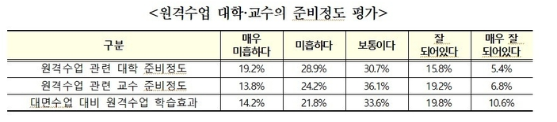

# 학습관리 IoT 시스템

### 비대면 교육체제 내에서의 논의점

- 2019년 213개 일반대학의 온라인 강의 비중은 1%가 안되는 0.92%였고, 총 58만 8450개의 오프라인강좌에 비해, 온라인강좌는 5,456개에 불과
- 온라인 강의가 존재하지 않는 대학도 있었음(J. S. Shin. (2020). There had been only 1% of online classes ... universities in panic. EDAILY (Online). https://www.edaily.co.kr/)
- 2020학년도 1학기 원격교육경험 및 인식조사 결과를 보면 긍정적인 답은 21.2%에 불과하고, 48.1%의 학생들이 비대면 수업에 불만족(Y. R. Kim. (2020). 48.1% of university students say "lack of preparation" for online classes Korea Education News(Online). https://www.hangyo.com/news/article.html?no=92430/)

- 학습자들이 교수자 및 동료 학습자들과의 상호작용 부족(김세영, 임유진, 김보경, 이예경, 2021; Rotas & Cahapay, 2020), 고립감(김영희, 2020; 김희영, 정우영, 2021; Raza, Qazi, Khan, & Salam, 2021), 온라인 강의 수강을 위한 적절한 장소 확보의 어려움(이승현, 함승환, 2021) 등으로 인해 부정적인 학습경험을 하는 것으로 보고하고 있다. 특히, 선행연구를 통해 가장 많이 지적되었던 지속적인 학습동기 유지의 어려움, 집중도 하락, 시간관리의 어려움과 같은 문제들(김세영 외, 2021; 김영희, 2020; 정향기, 2020; 최현실, 2021; Alawamleh, Al-Twait, & Al-Saht, 2020)

- 학습자가 학습전략을 어떻게 적용하는가는 온라인 학습과정과 성과에 영향을 미칠 수 있다(한가형, 임규연, 2020; Zhu, Zhang, Au, & Yates, 2020)

- 학교에서 소속감을 느끼기 어려운 상황에서 집에서 일상생활의 리듬이 깨지기 쉬워 비대면학습에 대한 부적응을 보인다고 보고된다(노성동, 2020)

- 대학생들은 COVID-19로 인해 대학 내 관계에서의 지지체계가 소홀해지는 데서 오는 우울, 무기력, 동기 감소, 불만족 등을 경험(최인철, 2020)

- 대면 수업의 경우 교사가 수행 주체를 관찰･확인 가능한 경우이므로 교사가 관찰한 내용을 평가하고 학생부에 기재가 가능한 반면, 완전 비대면 수업의 경우 교사가 수행 주체를 관찰･확인할 수 없는 경우이므로 원격수업에서 수행평가 결과를 학생부에 기재할 수 없고, 원격수업과 연계한 등교수업에서 관찰한 내용을 평가하고
  학생부에 기재할 수 있음(교육부, 2020b; 교육부 외, 2020).

- 코로나 19 이전의 국내 비대면 고등교육은 21개의 사이버 대학을 중심으로 시행되고 있었으며, 일반대학에서는 원격 교육을 20% 이내로 제한

  

- 교육행정 정보 시스템(NEIS), 원격교육 경험 및 인식조사 설문 기초 통계 분석 결과
  - 코로나 19와 같은 위기상황 시 지속적이고 안정적 학습이 가능하다는 것을 가장 큰 장점으로 꼽음
  - 학습동기, 참여 유도, 수업자료 제작, 소통 및 피드백 등의 전반에 어려움
  - 원격 수업에 문제를 겪을 때, 77.28%가 부모에게 도움을 청하는 것으로 나타남

